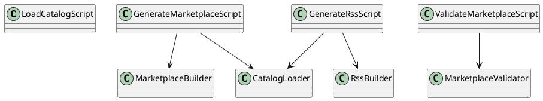

# README.md

## Purpose

Contains build and validation tooling plus their reusable helper modules.

## Public entrypoints

- `generate-marketplace-json.ts`
- `validate-marketplace-json.ts`
- `generate-rss-feed.ts`
- `lib/catalog.ts`
- `lib/marketplace.ts`
- `lib/marketplace-validation.ts`
- `lib/rss.ts`

## Dependency rules

- Scripts may depend on `src/lib` types and shared contracts.
- Entry scripts should stay thin and delegate logic to `scripts/lib`.

## Extension guidance

- Put new generation, validation, or parsing logic under `scripts/lib`.
- Keep CLI entrypoints minimal wrappers around reusable functions.

## PlantUML

