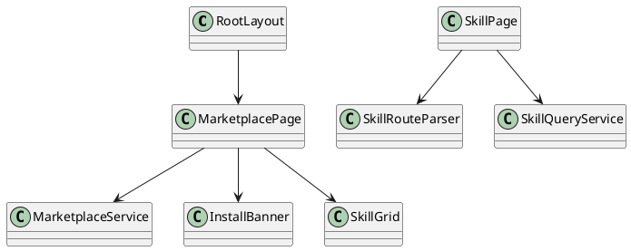

# README.md

## Purpose

Owns Next.js route composition, metadata, and static parameter generation.

## Public entrypoints

- `layout.tsx`
- `page.tsx`
- `skill/[...slug]/page.tsx`

## Dependency rules

- Depend on `src/lib` for business logic and typed contracts.
- Depend on `src/components` for rendering primitives.
- Do not duplicate filtering, route parsing, or command-building logic here.

## Extension guidance

- Keep pages thin and composition-focused.
- Extract any reusable decision logic into `src/lib` before it grows inside route files.

## PlantUML

