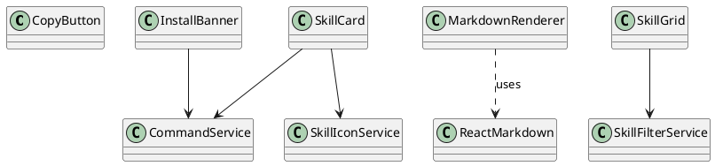

# README.md

## Purpose

Contains presentation-focused React components that render data supplied by `src/lib`.

## Public entrypoints

- `CopyButton`
- `InstallBanner`
- `MarkdownRenderer`
- `SkillCard`
- `SkillGrid`

## Dependency rules

- Components may depend on `src/lib` for typed helpers and simple selectors.
- Components should not perform repository fetch orchestration or route resolution.

## Extension guidance

- Keep components declarative and prop-driven.
- Extract reusable UI behavior only when it serves multiple renderers.

## PlantUML

