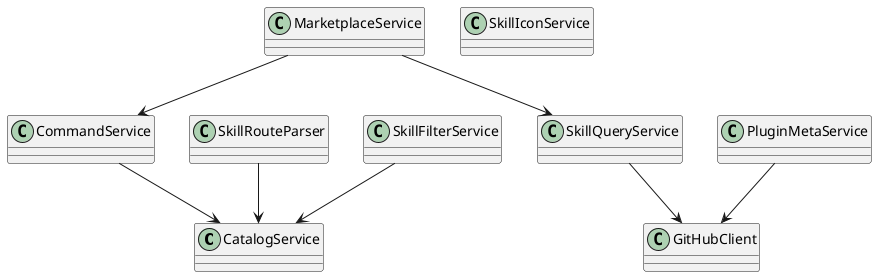

# README.md

## Purpose

Hosts the repository's business logic, typed contracts, command builders, route helpers, filtering logic, and GitHub integration services.

## Public entrypoints

- `catalog`
- `commands`
- `github`
- `marketplace`
- `routes`
- `skills`

## Dependency rules

- This is the main dependency target for `src/app`, `src/components`, and `scripts`.
- Keep outward-facing APIs narrow and type-first.
- Avoid leaking implementation details between submodules without an explicit export.

## Extension guidance

- Add new domain helpers in the narrowest namespace possible.
- Prefer pure functions and interfaces over large multi-purpose utilities.
- Extract shared logic here before duplicating behavior in pages, components, or scripts.

## PlantUML

